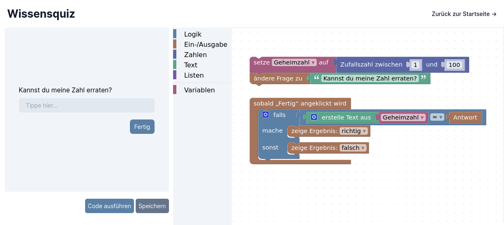
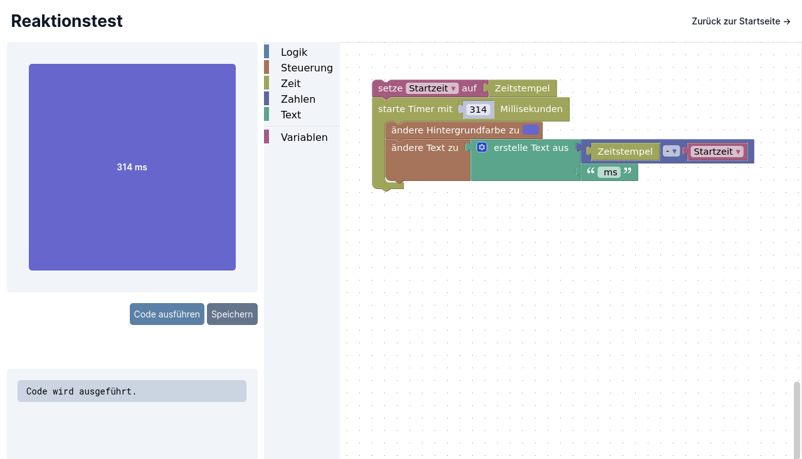
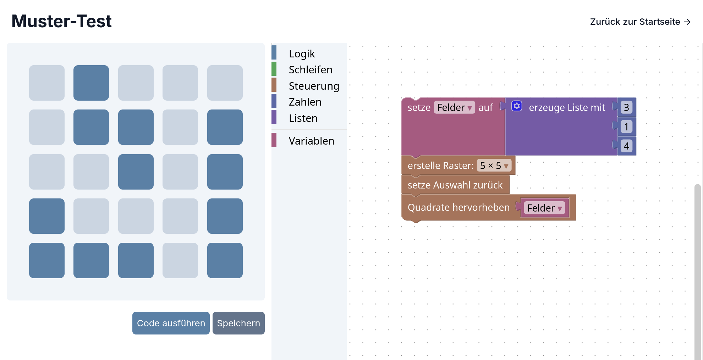

# Workshop

In diesem Workshop werden die Grundlagen der Programmierlogik möglichst einfach
und selbsterklärend vermittelt. Dabei wird bewusst keine „echte“
Programmiersprache verwendet, um einen einfacheren Zugang zum Programmieren zu
ermöglichen.

_Diese Anwendung ist nicht dafür ausgelegt, sich Programmieren selbst
beizubringen. Sie dient als Grundlage für den Workshop._

## Apps

### Wissensquiz



> Erweitere deine geistigen Horizonte und stelle dich einer Herausforderung! In
> diesem Test bist du eingeladen, dein Wissen auf die Probe zu stellen, indem du
> auf eine Vielzahl von Fragen antwortest. Lass deine kreative Ader fließen und
> gestalte dein eigenes kleines Allgemeinwissensquiz oder teste deine
> mathematischen Fähigkeiten mit einem herausfordernden Kopfrechentraining.
> Egal, ob du ein Neuling oder ein Meister auf deinem Gebiet bist, dieser Test
> wird deine grauen Zellen zum Glühen bringen und dein Vertrauen in deine
> Fähigkeiten stärken. Also tritt an und entdecke, was du alles erreichen
> kannst!

Diese App ist die perfekte Einführung in die Welt der Programmierung. Hier
lernen Anfänger, wie man logische Wenn-Dann-Verknüpfungen erstellt und wie man
Variablen verwendet. Die Schüler werden ermutigt, ihre eigenen Ideen zu
entwickeln und ihre Kreativität durch das Programmieren von eigenen Quiz-Ideen
zu fördern. Zusätzlich bietet diese App die Möglichkeit, Schülern eine erste
Einführung in Listen zu geben. Ein Beispiel dafür ist das
[Endlosquiz](./docs/quiz/endless.png), bei dem Schüler Listen mit Fragen und
Antworten erstellen, um diese dann für die Validierung zu benutzen.

### Reaktionstest



> Spüre den Nervenkitzel und schärfe deine Reaktionsfähigkeit! Dieser Test ist
> darauf ausgelegt, deine Fähigkeit zu trainieren, schnell und präzise auf
> Veränderungen zu reagieren. Sobald sich die Farbe des Textfelds ändert, ist es
> deine Aufgabe, blitzschnell darauf zu klicken. Aber lass dich nicht täuschen -
> die Zeit zwischen den Farbwechseln wird zufällig variieren, um dich auf Trab
> zu halten. Jeder Klick wird genau gemessen, um deine Reaktionszeit zu
> bewerten.

Diese App ist der perfekte nächste Schritt, um das Verständnis von Schülern in
der Programmierung zu vertiefen, insbesondere nachdem sie die Grundlagen der
vorherigen App gemeistert haben. Hier müssen mehr Variablen und komplexeren
Wenn-Dann-Verknüpfungen eingesetzt werden, sodass Schülern ihr Verständnis in
diesem Bereich vertiefen können. Darüber hinaus gibt es auch neue Bausteine, die
auf der Zeit basieren, wie Timer oder Zeitstempel, die Schülern helfen, Zeit-
und Ablaufsteuerung in ihre Anwendungen zu integrieren. Die Schüler werden auch
lernen, wie man die verschiedenen Funktionen der App kombiniert, um komplexere
Anwendungen zu erstellen.

### Sequenz-Test


> Bereite dich darauf vor, dein Gedächtnis zu schärfen! Dieser Test fordert dich
> heraus, eine zufällige Reihenfolge auf den neun Feldern zu merken und sie dann
> korrekt wiederzugeben. Jeder Schritt wird komplexer, da du dich an eine
> längere Sequenz von Eingaben erinnern musst. Kannst du die Herausforderung
> meistern und dein Gedächtnis auf die nächste Stufe bringen?

In dieser Anwendung werden Schüler erstmals mit Schleifen-Blöcken konfrontiert,
wiederkehrende Abläufe zu programmieren. Die blinkenden Schaltflächen bieten
eine anschauliche Möglichkeit, die Funktionsweise der Schleifen-Blöcke zu
demonstrieren und den Schülern die Bedeutung von Schleifen in der Programmierung
zu verdeutlichen. Ein weiterer wichtiger Aspekt der Anwendung sind Listen, die
in diesem Kontext noch intensiver behandelt werden. Schüler können ihre
Kenntnisse im Umgang mit Listen vertiefen, indem sie sie in der Anwendung
verwenden, um Daten wie Benutzereingaben zu organisieren und zu verwalten.

### Muster-Test



> Visuelles Gedächtnisspiel: Beobachte genau, welche Felder kurz aufleuchten und
> gib die richtige Reihenfolge wieder. Je weiter du kommst, desto
> anspruchsvoller wird die Abfolge. Schnelligkeit ist nicht entscheidend,
> sondern deine Fähigkeit, Muster zu erkennen und Informationen im Kopf zu
> behalten. Wie viele Schritte kannst du dir merken?

In dieser Anwendung setzen sich die Schüler mit dem strukturierten Aufbau einer
komplexeren Programmieraufgabe auseinander. Dabei übertragen sie bereits
gelernte Konzepte wie Listen und Schleifen auf einen neuen Kontext. Listen
kommen verstärkt zum Einsatz, um die angezeigten Muster sowie die
Benutzereingaben zu speichern, zu vergleichen und zu verwalten. Ziel ist es, die
Anwendung logisch zu strukturieren und das Zusammenspiel dieser grundlegenden
Konzepte sicher anzuwenden.

### Lösungen

Musterlösungen für die Apps sind im Verzeichnis [`/docs`](./docs) zu finden.

## Entwicklung und Installation

### Quickstart

```sh
# Repo klonen
$ git clone git@github.com:xp4u1/workshop

# Pakete herunterladen
$ pnpm install

# Anwendung im Entwicklungsmodus starten
$ pnpm start
```

### Build

```sh
# Build (production ready)
$ pnpm build

# In Unterverzeichnis, z. B. "example.com/workshop"
$ pnpm build --public-url "/workshop"
```

Nach dem Erstellen befindet sich der Build im Verzeichnis `/dist`. Die Dateien
im `/dist/web` Verzeichnis können auch ohne den Express-Server ausgeführt
werden. Wenn der Express-Server verwendet wird, kann man ein Test-Gerät
hinzufügen, indem man `deine-url.com/companion.html` aufruft. Sobald der
Anwender auf „Code ausführen“ klickt, wird der generierte Code an das Test-Gerät
gesendet. Die Companion-Seite kann im Browser aufgerufen werden, aber es besteht
auch die Möglichkeit, eine App zu verwenden. Weitere Informationen dazu findest
du [hier](./app).

### Docker

```sh
# Image bauen
$ docker build -t workshop

# Container erstellen
$ docker run -it --name workshop --rm -p 3000:3000 workshop
```
