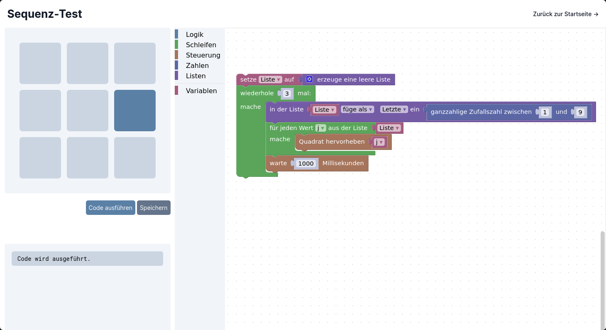

# Workshop

In diesem Workshop werdem die Grundlagen der Programmierlogik möglichst einfach und selbsterklärend vermittelt. Dabei wird bewusst keine „echte“ Programmiersprache verwendet, um einen einfacheren Zugang zum Programmieren zu ermöglichen.

## Apps

### Sequenz-Test



Bei diesem Test soll das Gedächtnis trainiert werden. Das Ziel ist es, auf den neun Feldern eine zufällige Reihenfolge anzuzeigen, die der Benutzer dann eingeben muss. Dabei wird die Sequenz in jedem Schritt um eine Eingabe länger.

### Todo

- Reaktions-Test
- ...

## Entwicklung

```sh
# Repo klonen
$ git clone git@github.com:xp4u1/workshop

# Pakete herunterladen
$ yarn

# Anwendung im Entwicklungsmodus starten
$ yarn start
```
